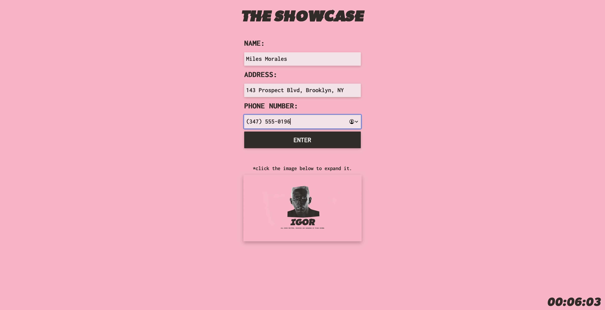

# interactive-ui-showcase
A fairly rough first attempt at an interactive website built using JavaScript, jQuery, and DOM manipulation techniques! It features a real-time clock at the bottom right, a form with various parameter checks ensuring the user inputs the information correctly, and a high-res image which expands to fit the whole screen when pressed. The website was styled after the album cover of Tyler, the Creator's "IGOR" album, and the final design can be seen below:

